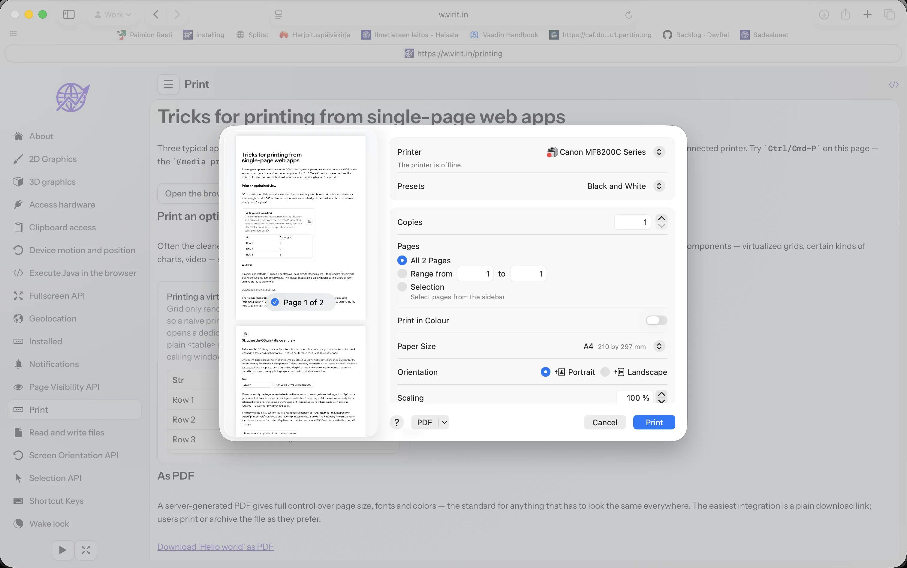
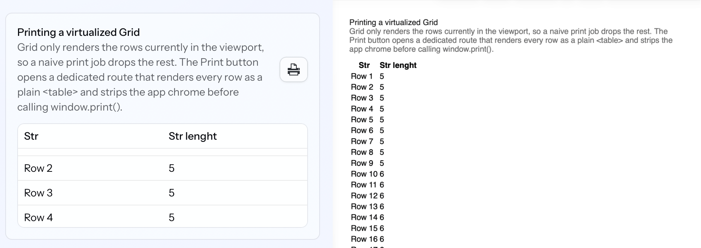
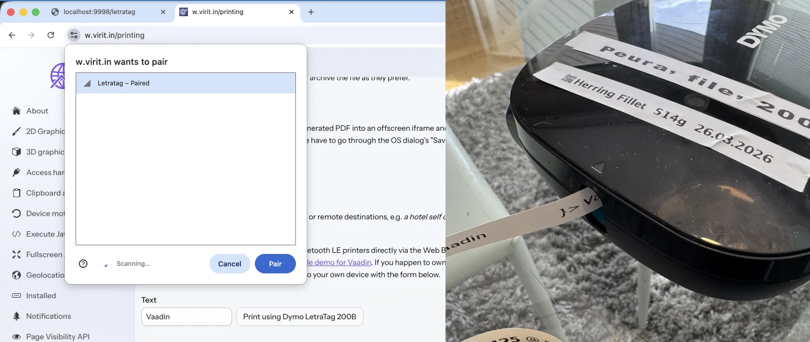
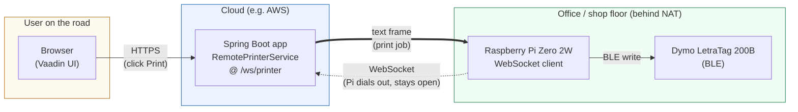

# Printing and Saving PDFs From Web Apps

Printing from a browser looks trivial — until you try it. A modern web UI is built
around a scrolling viewport, virtualized lists, fixed drawers and other overlays
that the user never thinks about, but that a printer happily reproduces on A4. This
post walks through the four options I reach for when a Vaadin app needs to produce
paper (or PDFs), with runnable snippets taken from the companion [`wwcd` demo project](https://w.virit.in/)
and notes on when each approach earns its keep.


*Printing a demo view from Safari. Same DOM, one `@media print` stylesheet apart*.

The four approaches we'll cover:

1. **Print the live DOM**, tuned with a `@media print` stylesheet.
2. **Render a second, print-optimized view** for content that the live UI can't
   reasonably paginate (virtualized Grids, certain charts, video).
3. **Generate a PDF on the server** and hand it to the user.
4. **Bypass the OS print dialog altogether**, either via Web Bluetooth in the
   browser or by pushing the job to a service-connected printer.

## 1. Just print and style with CSS

Every browser has an OS-native print dialog and a well-understood `Ctrl/Cmd-P`. You
*can* trigger it from JS with `window.print()`, but most users already know the
shortcut, so a button is usually redundant.

The real problem is that a web page was not designed for paper. Modern browsers support
`@media print` well, and that applies to Vaadin apps just like any other HTML. If printing
is a common action in your app, spend fifteen minutes on a print stylesheet — remove
irrelevant chrome, adjust margins, flatten backgrounds.

In a Vaadin app, the most common obstacle is `vaadin-app-layout`. It's a textbook
example of a layout designed for scrolling, not paper. It works fine once you know
where to poke it:

```css
@media print {
    /* Hide anything the developer marks as screen-only. */
    .noprint { display: none; }

    /* Hide navbar and drawer — they waste space and break page flow. */
    vaadin-app-layout::part(navbar),
    vaadin-app-layout::part(drawer) {
        display: none;
    }

    /* app-layout precomputes padding for the drawer and doesn't recalculate
       when we hide it. Force padding to 0 and let content overflow. */
    vaadin-app-layout {
        padding-left: 0;
        overflow: visible;
        height: auto;
    }

    /* Flatten backgrounds so page 2 doesn't inherit a body gradient. */
    html,
    vaadin-app-layout vaadin-vertical-layout {
        background: none !important;
        border: none !important;
    }

    /* Make sure the dev-mode overlays never hit the page. */
    copilot-main, vaadin-dev-tools { display: none; }
}
```

If you take the CSS media query route, you'll probably want a helper class for
components that shouldn't end up on paper. My demo uses `.noprint` (see the first
rule in the block above), applied for example to the "Print" button itself —
which doesn't help anyone on paper 😁:

```java
        add(new Button("Print") {{
            // See css rule below, ignore when printing using media query
            addClassName("noprint");

            getElement().executeJs("""
                        // opens print the OS print dialog
                        this.onclick = () => window.print();
```

Media queries can even target specific paper sizes, but resist the urge. A single layout
that survives A4, Letter and the occasional label printer beats a fork per format. Rules
can quickly become more difficult than your whole UI code.

## 1.b Print and use JS hook for preparations

With the Aura theme there's one extra quirk: the left padding is set via a CSS
custom property with an animated transition, and Chromium captures the pre-transition
value before the `@media print` rules kick in. Overriding it purely from CSS turned
out to be too much for my limited 3 decades of web development experience, but
hooking the `beforeprint` / `afterprint` events and nudging the padding from JS
works around it:

```js
window.addEventListener("beforeprint", () => {
    document.querySelector("vaadin-app-layout")
        .shadowRoot.querySelector("[content]").style.paddingLeft = "0";
});
window.addEventListener("afterprint", () => {
    document.querySelector("vaadin-app-layout")
        .shadowRoot.querySelector("[content]").style.paddingLeft = "";
});
```

The above is not needed with the good old Lumo theme. File under "things you discover 
only when someone prints the page for real." Events can be handy especially if you want to slightly modify also the DOM before printing it. For Java developers, tricks below suit better in most cases though.

## 2. Construct a print-optimized page

Some components are architecturally incompatible with printing. The canonical example
in Vaadin is the virtualized `Grid`: it only keeps the visible rows in the DOM and
loads the rest on scroll. There is no "dear browser, please materialize all 50 000
rows before you paginate" hook. There are several other similar components out there.

When CSS can't save you, but you still need to check "printable" in your
requirement docs, render a second view tailored for paper. In the demo app I keep
it in the same class and branch on a constructor flag. Best approach is probably 
application specific.

```java
@Route   // dedicated print route, no MainLayout
public class PrintOptimizedCard extends Card {

    public PrintOptimizedCard() { this(true); }          // route entry — print version

    public PrintOptimizedCard(boolean optimizeForPrinting) {
        setTitle("Printing a virtualized Grid");

        if (!optimizeForPrinting) {
            // Screen version: fast, virtualized Vaadin Grid
            add(new Grid<String>() {{
                setHeight("10em");
                setItems(rows);
                addColumn(s -> s).setHeader("Str");
                addColumn(String::length).setHeader("Len");
            }});
            setHeaderSuffix(new PrintRouteButton(PrintOptimizedCard.class));
        } else {
            // Print version: plain <table> with every row
            add(new NativeTable() {{
                add(new NativeTableRow() {{
                    add(new NativeTableHeaderCell("Str"));
                    add(new NativeTableHeaderCell("Len"));
                }});
                rows.forEach(s -> add(new NativeTableRow() {{
                    add(new NativeTableCell(s));
                    add(new NativeTableCell(s.length() + ""));
                }}));
            }});
            getStyle().set("font-family", "Helvetica");
        }
    }
}
```

The "Print" button on the screen version opens the dedicated route in a hidden
iframe and calls `print()` on it — same hack as the PDF case below, different payload:

```java
public static class PrintRouteButton extends VButton {
    public PrintRouteButton(Class<? extends Component> routeClass) {
        setIcon(VaadinIcon.PRINT.create());
        addClickListener(e -> {
            var iframe = new Element("iframe");
            iframe.getStyle().setDisplay(Style.Display.NONE);
            iframe.setAttribute("src",
                RouteConfiguration.forSessionScope().getUrl(routeClass));
            getElement().appendChild(iframe);
            iframe.executeJs("""
                this.onload = () => setTimeout(() => {
                    this.focus();
                    this.contentWindow.print();
                }, 500);
                """);
        });
    }
}
```


*Virtually paged Grid is handy in UI, but for printed version you probably want all the rows.*

## 3. Generate a PDF

For anything that has to look *identical* on every device (invoices, tickets,
certificates, ID cards), the industry standard is a server-generated PDF. You pay
for the extra moving part with exact control over paper size, margins, fonts and
colors — including CMYK / spot colors that a browser's RGB-to-printer pipeline
would happily mangle.

The Java ecosystem has plenty of PDF libraries. In the demo I reach for **Apache
PDFBox**; [OpenPDF](https://github.com/LibrePDF/OpenPDF), [iText](https://itextpdf.com/)
(check the license), and [Flying Saucer](https://github.com/flyingsaucerproject/flyingsaucer)
(HTML → PDF) are reasonable alternatives depending on your needs.

A minimal PDFBox document:

```java
private static void writePDF(String content, OutputStream out) throws IOException {
    try (PDDocument document = new PDDocument()) {
        PDPage page = new PDPage(PDRectangle.A4);
        document.addPage(page);
        try (PDPageContentStream stream = new PDPageContentStream(document, page)) {
            stream.beginText();
            stream.newLineAtOffset(20, 700);
            stream.setFont(new PDType1Font(Standard14Fonts.FontName.COURIER), 12);
            stream.showText(content);
            stream.endText();
        }
        document.save(out);
    }
}
```

There are essentially two ways to hand that PDF to the user in a web app.

**Option A: a plain download link.** My default. Many users want the file for their
digital archive, not a physical copy; a download doubles as a print preview; and it
sidesteps every browser quirk in the print dialog.

```java
add(new Anchor() {{
    setText("Download 'Hello world' as PDF");
    setDownload(true);
    setHref(download -> {
        download.setContentType("application/pdf");
        writePDF("Hello world from PDF!", download.getOutputStream());
    });
}});
```

**Option B: the hidden-iframe print trick**, for a desktop-app feel where
clicking "Print invoice" opens the OS print dialog directly with the PDF loaded.
The Viritin add-on ships it as `PrintPdfButton`:

```java
add(new PrintPdfButton(out -> writePDF("This is directly printed PDF", out)));
```

The downside of Option B: a user who only wants to archive the document has to
go through the OS dialog's "Save as PDF" path. If archiving is a common case,
stick with Option A.

## 4. Skip the OS print dialog entirely

Sometimes the OS dialog is in the way — you want automation, or the printer is
physically elsewhere. Classic use cases:

- A hotel self check-in kiosk dropping a receipt on a lobby printer.
- A warehouse picker scanning items and printing labels on a fixed Dymo.
- A field service tech submitting a job from their phone to a printer back at
  the office.

The great thing in this approach is that the print job no more needs to be triggered
by a direct user interaction in the computer. They can be scheduled or automatically 
triggered by another hardware interaction. In a recent hobby app I'm initiang a 
label printing automatically when a Bluetooth scale (also accessed via WebBluetooth) 
gets a solid reading. 

The job naturally has to reach the device some other way. Two example paths:

### 4a. Talk to the printer from the browser (Web Bluetooth)

Chromium-based browsers can pair with some Bluetooth LE printers directly via the
[Web Bluetooth API](https://developer.mozilla.org/en-US/docs/Web/API/Web_Bluetooth_API).
The browser handles pairing; your code writes bytes to a characteristic. Good fit
for handheld label printers where each user has their own device.

In [the demo app](https://w.virit.in/printing), `DymoLetraTag200B` add-on wraps the pairing + characteristic writes as a
hidden Vaadin component. The server side is mercifully thin:

```java
var name = new VTextField("Text");
name.setValue("Vaadin");

var printer = new DymoLetraTag200B();
add(printer);  // must live in the component tree

add(new HorizontalFloatLayout(name, new Button("Print using Dymo LetraTag 200B",
    e -> printer.print("}> " + name.getValue()))));
```


*The Chrome Bluetooth pairing dialog listing a "LetraTag" device and the label printer in action*

Two older community examples worth a look:

- [`flow-bluetooth-printer`](https://github.com/Wnt/flow-bluetooth-printer)
- [Vaadin Point-of-Sale AI demo](https://github.com/vaadin/point-of-sales-ai-demo) —
  a more recent, vibe-coded exploration.

Limits: Firefox and Safari don't ship Web Bluetooth, the pairing UX surprises
first-time users, and every printer model needs its own protocol wrapper. Works
great if you control the hardware *and* the browser — kiosk, warehouse tablet,
company-issued phones. Less great as a general public-internet feature.

### 4b. Print from the server (or a custom service)

The most undervalued option. If your users are on known networks, or if "the
receipt shows up within a minute" is good enough, server-side printing is almost
always simpler to operate than client-side Bluetooth.

From Linux, the brute-force approach is still fine:

```bash
lp /tmp/generated.pdf
```

One `Runtime.exec`, one temp file, done — provided the printer is configured and
reachable from the server. For anything more structured, [cups4j](https://github.com/harwey/cups4j)
lets you submit jobs, query queues, and list printers from Java. Many modern
office printers expose a CUPS endpoint themselves, so no intermediate print
server is required — just a hole in the firewall.

For printers that *can't* reach the server, flip the connection: let the printer
side open a socket to the server instead. In the demo, a small Raspberry Pi talks
BLE to the same Dymo as above (it could just as well drive a regular office
printer) and registers itself over a WebSocket. The server broadcasts jobs on
that socket; the Pi does the BLE write locally.

A minimal implementation — one Spring `@Service` that doubles as a
`TextWebSocketHandler`:

```java
@Service
public class RemotePrinterService extends TextWebSocketHandler {

    private final Set<WebSocketSession> printers = new CopyOnWriteArraySet<>();

    public boolean printerAvailable() { return !printers.isEmpty(); }

    public void print(String text) {
        TextMessage msg = new TextMessage(text);
        for (WebSocketSession s : printers) {
            try {
                synchronized (s) { s.sendMessage(msg); }
            } catch (IOException e) { printers.remove(s); }
        }
    }

    @Override public void afterConnectionEstablished(WebSocketSession s) { printers.add(s); }
    @Override public void afterConnectionClosed(WebSocketSession s, CloseStatus c) { printers.remove(s); }
}
```

```java
@Configuration
@EnableWebSocket
class PrinterWebSocketConfig implements WebSocketConfigurer {
    private final RemotePrinterService service;
    PrinterWebSocketConfig(RemotePrinterService s) { this.service = s; }

    @Override public void registerWebSocketHandlers(WebSocketHandlerRegistry r) {
        r.addHandler(service, "/ws/printer").setAllowedOriginPatterns("*");
    }
}
```

From a Vaadin view you don't see the WebSocket at all — it's just a method call:

```java
if (remotePrinterService.printerAvailable()) {
    remotePrinterService.print(LocalDateTime.now() + " @ server time");
    Notification.show("Print job sent");
} else {
    Notification.show("Printer offline");
}
```

The Raspberry Pi side is beside the point of this post, but if you're curious
[the Java sources are on GitHub](https://github.com/viritin/webbluetooth-drivers/tree/main/rpi-letra-example) (yes, modern Java runs great even on a $15 Pi Zero 2W with 512mb of memory 😎).

**Architecture at a glance:**



The key detail: the WebSocket is dialed **from the Pi outward**, not from the
server inward. The printer can sit behind any NAT / firewall the office already
has — no inbound ports, no VPN, no static IP. The server only ever *answers*
connections; it doesn't have to find the printer.

Nothing about this pattern is BLE-specific. Swap the Pi for a workstation on an
office LAN, the BLE write for a `lp` call, and you have the same design for any
USB or network printer — without needing any firewall adjustments. Just be sure 
to complete the PoC with some security adjustments or I'll be printing your secret
documents with my Dymo 🤓.

## Picking an approach

| Need                                         | Reach for                                    |
|----------------------------------------------|----------------------------------------------|
| Occasional print of an existing view         | `@media print` + `.noprint`                  |
| Printing a virtualized Grid or chart         | Dedicated print route + iframe trick         |
| Pixel-perfect documents, archival            | Generated PDF + download link                |
| Desktop-app feel, one-click print            | Generated PDF + `PrintPdfButton`             |
| Direct-to-label, controlled hardware         | Web Bluetooth                                |
| Fixed printers, automation, remote locations | Server-side (`lp` / cups4j / WebSocket bridge)|

None of these is wrong — they optimize for different things. Start from the user's
actual need ("do they want the paper, the file, or the automation?") and the
integration pressure falls into place.
